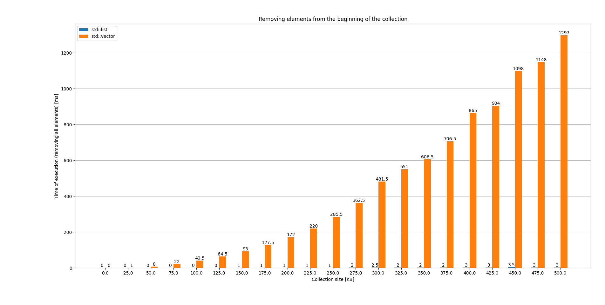
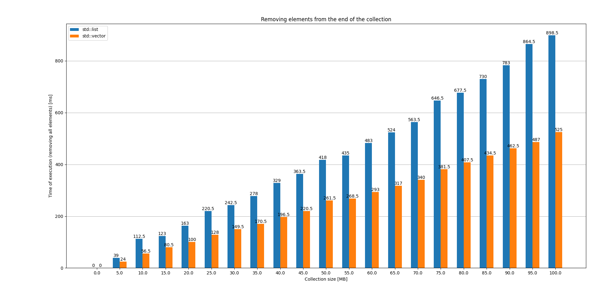
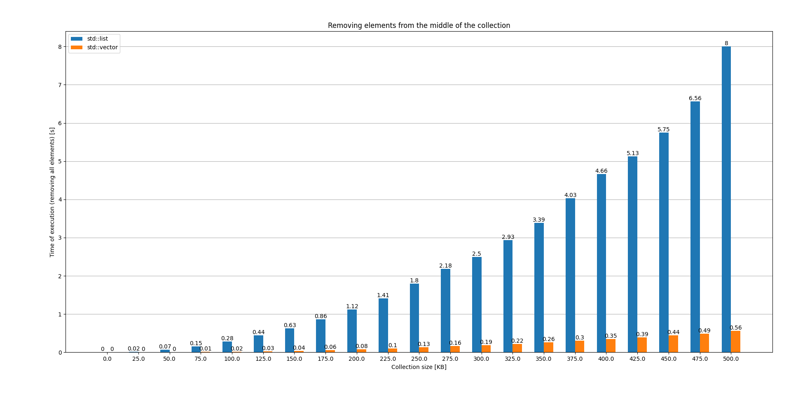

## Assignment

This assignment was to benchmark the performance of element deletion from an `std::vector` and a `std::list`. There were three scenarios taken into account, representing the position from which an element can be erased - beginning, end, and the middle of the collection.

## Solution

I decided to measure how much time it takes to delete an entire collection by repetitively deleting an element from the same position. I also ran this benchmark test on different collection sized.

The following snippet measures how much time it takes to delete a single element.


```c++
template<typename Container, NRemoval_Type removal_type>
[[nodiscard]] inline double Remove_Element(Container& data) const
{
    const std::size_t index_middle = data.size() / 2;
    auto it_middle = data.begin();

    const auto start_time = Clock::now();

    switch (removal_type)
    {
        // Remove the element at the beginning of the container.
        case NRemoval_Type::Begin:
            data.erase(data.begin());
            break;

        // Remove the element at the end of the container
        case NRemoval_Type::End:
            data.erase(std::prev(data.end())); // data.end() - 1
            break;

        // Remove the element at the middle of the container.
        case NRemoval_Type::Middle:
            std::advance(it_middle, index_middle);
            data.erase(it_middle);
            break;

        default:
            break;
    }

    // Measure the end time.
    const auto end_time = Clock::now();

    // Calculate how much time it took to remove the element.
    return std::chrono::duration_cast<std::chrono::nanoseconds>(end_time - start_time).count();
}
```

Times collected from this method are being added up until there are no elements left in the collection. To measure time precisely, I used `std::chrono::high_resolution_clock`. One could argue that the `switch` statement affects the results. However, since the method is templated, it is all resolved at compile time, leaving only one of the three options in the body of the method. To verify this, I checked out the disassembled version of the program.

### Removing an element from the beginning of the container


## Results

### Removing an element from the beginning of the container



### Removing an element from the end of the container



### Removing an element from the middle of the container




## Running the program

### Configuration

Depending on your desire, you will need to uncomment on of the following methods in `main.cpp` as well as adjust the configuration in `config.h`.

```c++
int main()
{
    using namespace kiv_vss;

    // kiv_vss::Run_Benchmark<benchmark::NRemoval_Type::End>("end.json");   
    // kiv_vss::Run_Benchmark<benchmark::NRemoval_Type::Begin>("begin.json");
    // kiv_vss::Run_Benchmark<benchmark::NRemoval_Type::Middle>("middle.json");

    return 0;
}
```

```c++
inline constexpr std::size_t Start_Collection_Size = utils::Convert_KB_To_B(0);
inline constexpr std::size_t End_Collection_Size = utils::Convert_KB_To_B(500);
inline constexpr std::size_t Step_Size = utils::Convert_KB_To_B(25);
```

### Compilation

```
cmake -S . -B build/release -G "Unix Makefiles" -DCMAKE_BUILD_TYPE=Release
```
```
make -C build/release
```

### Execution (Linux)

```
./build/release/src/benchmark
```

If you are on Windows, you just need to run the `exe` file located in `build/release/src`.
